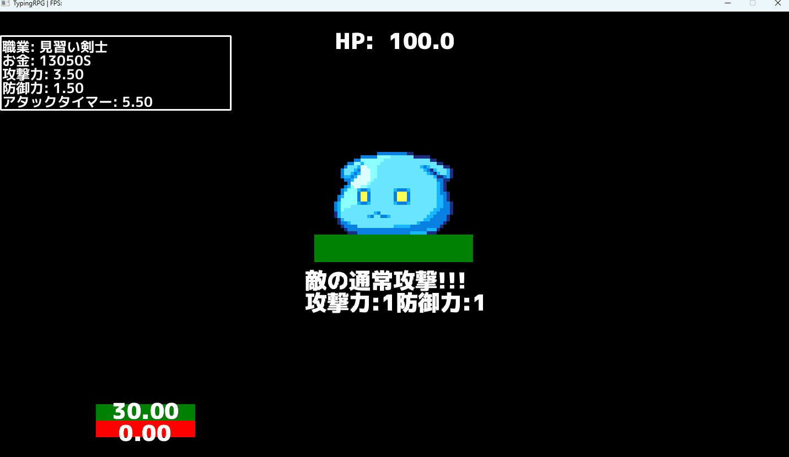
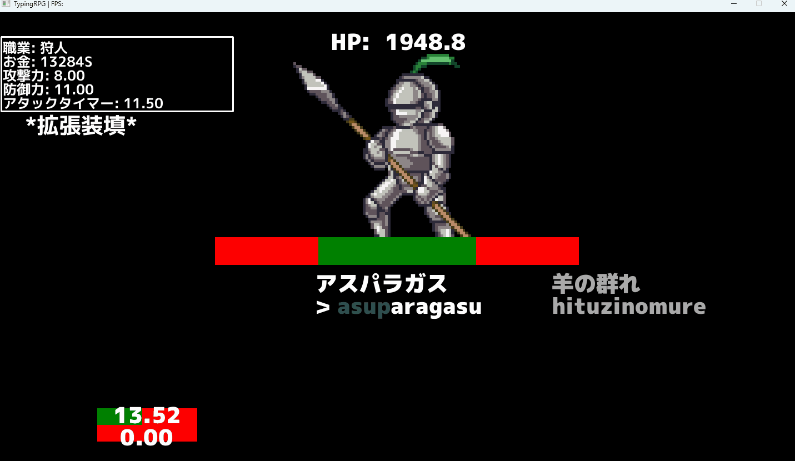
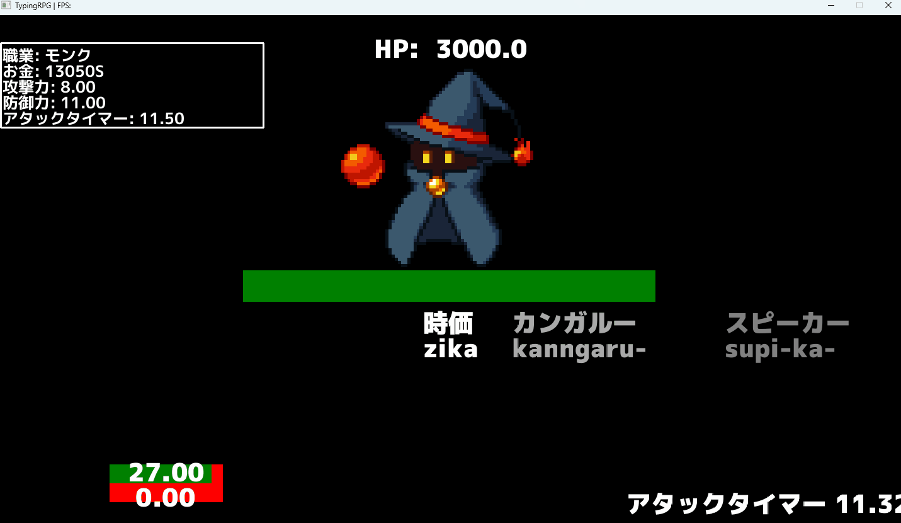

# TypingRPG

## 概要

TypingRPG は、キーボードで英単語を入力しながらモンスターを倒していく RPG ゲームです。プレイヤーは冒険の途中で様々なアイテムを手に入れたり、装備を作成し、最後のボスを倒すことを目指します。

## インストール方法

まず、このファイルを解凍します。
解凍後 typingRPG_v2.0.0 内の exe ファイルを実行することでゲームが開始します。

### 遊び方

基本的にキーボードのみの操作です。

1. ダンジョン
   - 全 10 ステージあり、1 ステージクリアするごとに順次解放されていきます。
   - ステージをクリアすると、獲得したお金や素材等が表示され、初クリア時には、アイテムのアンロックが行われます。
     ※バトルシステムに関しては後述
2. 町
   - 武器、防具、アクセサリーを作成できます。作成時は素材と費用を必要として、同じ種類の装備は 1 つしか作成できません。
   - 作成が完了するとお金と素材が減り、装備画面から装備ができます。
3. 装備
   - ここで作成した武器や防具を装備することができます。装備は 1~0 のキーを入力して行います。装備が完了すると左上のステータスが変化し、武器の名前の横に E お表示されます。
     ※現バージョンでは、装備は順番に作成する必要があります。
   - Tab キーで武器、防具、アクセサリー、素材の画面を切り替えることが可能です。
4. ジョブ
   - ジョブを選択できます。ジョブはそれぞれ異なる戦闘スタイルを持っています。ジョブの戦闘スタイルに関しては、JobDescription.md ファイルを参照してください。
     ※ネタバレを含みます。

### バトルシステム

バトルにはプレイヤーの攻撃、敵の攻撃、プレイヤーのスキル発動の 3 つのターンが存在します。

- プレイヤーの攻撃
  - アタックタイマーが 0 になるまで入力することができ、職業によって攻撃方法が異なります。
  - 一文字毎にスキルポイントが 2 ずつたまります。スキルポイントが 50 になった状態で Space キーを押すと職業に応じたスキルが発動します。
- 敵の攻撃
  - 敵の攻撃テキストと、敵の攻撃力、防御力が表示されます。
  - この画面で Enter キーを押すと敵の攻撃が開始します。
- プレイヤーのスキル発動
  - 職業毎に異なるスキルが発生します。

### バトルの例

#### 戦闘はターン制で行われ、プレイヤーは単語を入力して攻撃を行います。

#### 様々な職業を選択できます。狩人の場合は、単語を装填してから Enter で発射します。更に武器や防具による固有のスキルも存在します。

#### 魔法使いは魔力をためて大ダメージを狙います。ミスタイプをしたら魔力が解放され、攻撃力が下がります。固有スキルは体力回復効果を持ちます。

#### モンクは一文字毎に攻撃&スキル判定が入ります。他の職業よりも素早く攻撃でき、スキルを多く発動できます。

## 依存関係

TypingRPG は、以下の外部ライブラリに依存しています。

    go 1.20

    github.com/faiface/pixel v0.10.0
    github.com/golang/freetype v0.0.0-20170609003504-e2365dfdc4a0
    github.com/pkg/errors v0.9.1
    golang.org/x/image v0.7.0

github.com/nsf/termbox-go

## ライセンス

TypingRPG は、MIT ライセンスのもとで公開されています。

## 著者

TypingRPG は、[yuyuyu2118]によって開発されました。連絡先は、[aiyyy2045@gmail.com]です。

## クレジット

TypingRPG に使用されている素材は、以下のサイトから提供されています。

[https://mplus-fonts.osdn.jp/about2.html]
[https://sushida.net/]
[https://rosemilktea.booth.pm/]
