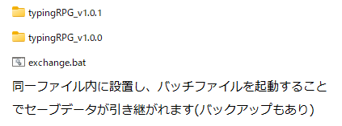

<<<<<<< HEAD
<<<<<<< HEAD
=======
>>>>>>> 7d1824f (v1.0.3test)
# typingRPG_v1.0.3test(2023年6月9日)

### 追加要素

- 武器全種のスキル追加
- 防具全種のスキル追加
- アクセサリー全種のスキル追加
- 鍛冶屋の追加、武器のみ(※リロードしないと更新されません)
<<<<<<< HEAD
=======
# typingRPG_v1.0.3(2023年6月日)

### 追加要素

<<<<<<< HEAD
- 武器の固有スキルを設定
>>>>>>> 4715f1e (武器の固有スキルを設定)
=======
- 武器全種のスキル追加
- 防具9種のスキル追加
>>>>>>> c9826ea (武器全種のスキル追加)
=======
>>>>>>> 7d1824f (v1.0.3test)

### 変更点

- ドロップゴールド倍率0.6→0.5
<<<<<<< HEAD
<<<<<<< HEAD
- アイテムドロップ率変更
=======
>>>>>>> 4715f1e (武器の固有スキルを設定)
=======
- アイテムドロップ率変更
>>>>>>> 7d1824f (v1.0.3test)

### 修正点

- Koboldと戦えないバグの修正
<<<<<<< HEAD
<<<<<<< HEAD
- 文言修正
=======
=======
- 文言修正
>>>>>>> c9826ea (武器全種のスキル追加)

<<<<<<< HEAD
### セーブファイルの上書き方法

>>>>>>> 4715f1e (武器の固有スキルを設定)

=======
>>>>>>> 7d1824f (v1.0.3test)
### 前バージョン

typingRPG_v1.0.0 (2023年6月2日)

typingRPG# typingRPG_v1.0.1(2023年6月6日)
変更点
- 武器、防具、アクセサリーの作成コスト調整、素材調整
- 作成時の所持素材表示、作成済み武器の表示
- 化け物の特性でダメージを受けるときの描画を追加
- ドロップゴールド倍率1.0→0.3
修正点
- 装備画面の表示バグ修正
- 新コンテンツ追加時の表示修正
- Enter連打で敵アニメーションが繰り返されるバグ修正
- 化け物のスキルが特定の条件下で使えないバグを修正
- ゴブリン→コボルト文言修正
- 化け物、モンスターの表記ブレ修正、化け物に統一
- 長い単語が重なるバグを修正
- アタックタイマー位置修正

typingRPG_v1.0.2(2023年6月6日)
変更点
- ドロップゴールド倍率0.3→0.6
修正点
- 初回起動できないバグの修正
セーブファイルの上書き方法
 